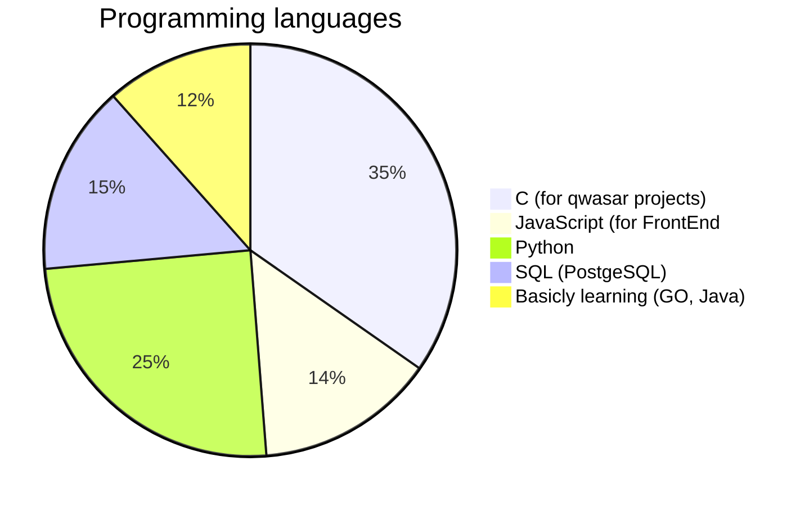

# Hi, I’m Mirjamol 

- 👀 My hobbies is watching TV and travels

- 🌱 I’m currently learning C and Java

- :information_desk_person: I'm student at [Qwasar Silicon Valley](https://qwasar.io/)

- 📫 [my email](mailto:alpholmon@gmail.com)

## My use of programming languages

Contact:

>>| 
<a href="https://facebook.com/holmonalp">Facebook</a> **|**
<a href="https://twitter.com/holmonalp">Twitter</a> **|**
<a href="https://linkedin.com/holmonalp">LinkedIn</a>
<a href="tel:+998339180103">+998339180103</a>
>>|

  

<!---
holmon-alp/About-Me is a ✨ special ✨ repository because its `README.md` (this file) appears on your GitHub profile.
You can click the Preview link to take a look at your changes.
--->
